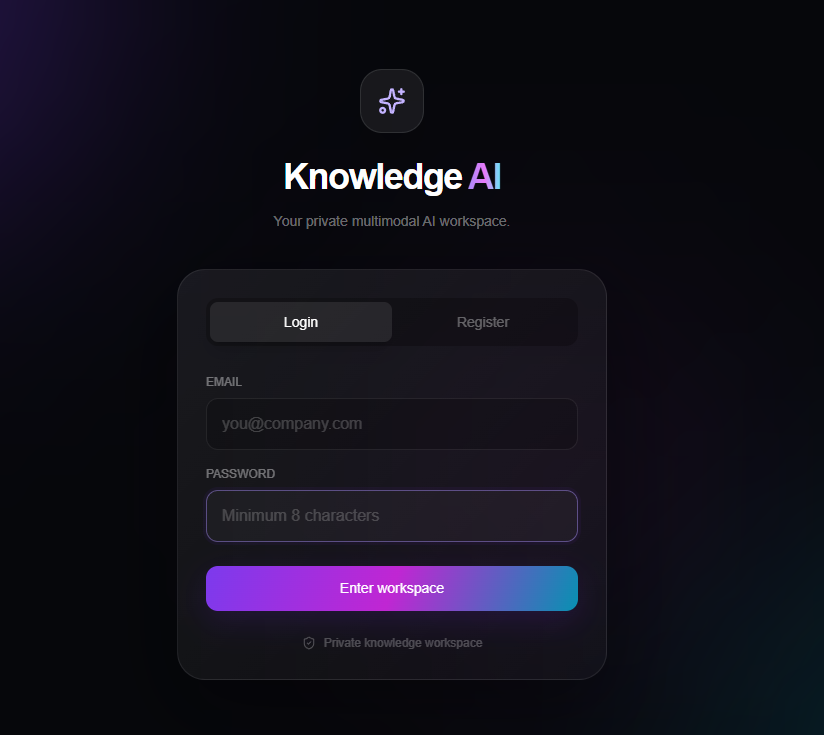
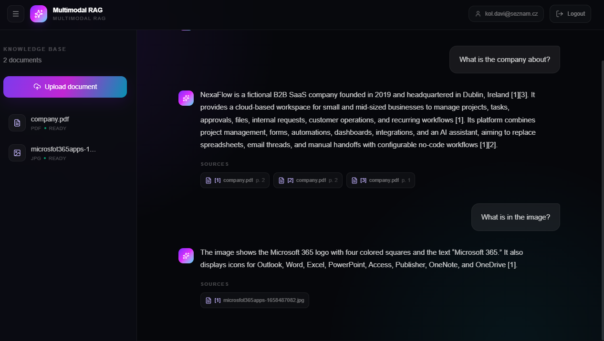

# Role-Based Multimodal RAG

A full-stack Retrieval-Augmented Generation (RAG) system with user authentication, document-level isolation, hybrid retrieval, reranking, multimodal document processing, and cited LLM answers.

## Frontend Preview

<p align="center">
  
  
</p>

## Features

- User registration and login with JWT authentication
- Separate knowledge base for each user
- Upload and process multiple file types:
  - PDF
  - TXT
  - DOCX
  - XLSX
  - PNG / JPG / JPEG
- Multimodal document processing for text and visual content
- Text chunking and embedding generation
- Persistent vector storage with ChromaDB
- Semantic retrieval using `BAAI/bge-base-en-v1.5`
- Keyword retrieval using BM25
- Reciprocal Rank Fusion (RRF) for hybrid retrieval
- Cross-encoder reranking of retrieved chunks
- LLM answer generation with inline citations
- FastAPI backend
- Next.js frontend

## RAG Pipeline

```text
User query
    |
    v
Authentication / User ID
    |
    +-----------------------+
    |                       |
    v                       v
Semantic Search          BM25 Search
(BGE embeddings)        (keyword retrieval)
    |                       |
    +-----------+-----------+
                |
                v
       Reciprocal Rank Fusion
                |
                v
       Cross-Encoder Reranker
                |
                v
          Top-K Context
                |
                v
               LLM
                |
                v
      Answer + Source Citations
```

## Document Processing Pipeline

```text
Uploaded document
      |
      v
File-type loader / extractor
      |
      v
Text + metadata extraction
      |
      v
Chunking
      |
      v
BGE embeddings
      |
      v
ChromaDB
```

Each stored chunk contains metadata such as the user ID and document ID, allowing retrieval to be restricted to the currently authenticated user's documents.

## Project Structure

```text
PROJECT/
│
├── data/
├── frontend/
├── loaders/
├── user_uploads/
│
├── bm25.py
├── chunker.py
├── embeddings.py
├── main_registration.py
├── reranker.py
├── retriever.py
├── vector_db.py
│
├── users.db
├── .env
├── .gitignore
└── README.md
```

### Main Modules

| File | Purpose |
|---|---|
| `main_registration.py` | FastAPI application, authentication, document upload, document management and chat endpoints |
| `retriever.py` | Full RAG retrieval and answer-generation pipeline |
| `bm25.py` | BM25 keyword retrieval |
| `reranker.py` | Cross-encoder reranking |
| `embeddings.py` | Embedding generation |
| `chunker.py` | Document chunking |
| `vector_db.py` | ChromaDB vector storage |
| `loaders/` | File-specific loaders and content extractors |
| `frontend/` | Next.js user interface |

## Retrieval Strategy

The system uses a hybrid retrieval pipeline instead of relying on vector similarity alone.

### 1. Semantic Search

The user query is embedded using:

```text
BAAI/bge-base-en-v1.5
```

The query embedding is compared against document chunks stored in ChromaDB.

### 2. BM25 Search

BM25 retrieves chunks based on lexical and keyword relevance.

### 3. Reciprocal Rank Fusion

Results from semantic search and BM25 are combined using Reciprocal Rank Fusion:

```text
RRF score = 1 / (k + rank)
```

This allows the system to benefit from both semantic similarity and exact keyword matching.

### 4. Reranking

The best hybrid-search candidates are passed to a cross-encoder reranker:

```text
cross-encoder/ms-marco-MiniLM-L6-v2
```

The reranker evaluates the query and candidate chunks together and returns the most relevant context.

### 5. Answer Generation

The highest-ranked chunks are sent to the LLM. The model is instructed to:

- answer only from the supplied context
- avoid inventing missing information
- cite claims using retrieved source numbers
- return only sources actually cited in the answer

## Authentication and User Isolation

Users authenticate through JWT tokens.

Every uploaded document and indexed chunk is associated with a `user_id`. Retrieval queries filter ChromaDB by the current user's ID, preventing one user's documents from being returned to another user.

## Installation

### 1. Clone the repository

```bash
git clone https://github.com/thanatt16/role-based-multimodal-rag.git
cd role-based-multimodal-rag
```

### 2. Create a Python virtual environment

Windows:

```powershell
python -m venv .venv
.\.venv\Scripts\Activate.ps1
```

### 3. Install backend dependencies

Install the Python packages required by the project, including FastAPI, Uvicorn, ChromaDB, Sentence Transformers, OpenAI, SQLAlchemy and the document-processing dependencies used by the loaders.

### 4. Configure environment variables

Create a `.env` file in the project root:

```env
OPENAI_API_KEY=your_openai_api_key
JWT_SECRET_KEY=your_jwt_secret_key
```

Do not commit `.env` to GitHub.

## Running the Application

### Backend

From the project root:

```powershell
uvicorn main_registration:app --reload
```

The backend is available at:

```text
http://127.0.0.1:8000
```

FastAPI documentation:

```text
http://127.0.0.1:8000/docs
```

### Frontend

Open a second terminal:

```powershell
cd frontend
npm install
npm run dev
```

The frontend is typically available at:

```text
http://localhost:3000
```


## Technologies

**Backend**
- Python
- FastAPI
- JWT
- ChromaDB

**Retrieval / AI**
- Sentence Transformers
- BGE embeddings
- BM25
- Reciprocal Rank Fusion
- CrossEncoder reranking
- OpenAI API

**Frontend**
- Next.js
- TypeScript

**Document Processing**
- PDF
- DOCX
- XLSX
- TXT
- Images

## Security Notes

The following files and directories should not be committed to a public repository:

```gitignore
.env
.env.*
.venv/
__pycache__/
*.pyc
chroma_db/
user_uploads/
users.db
frontend/node_modules/
frontend/.next/
```

Keep API keys, JWT secrets, uploaded user documents, local databases, and vector databases outside version control.


## Author

Developed as an AI engineering project focused on production-oriented multimodal RAG, hybrid retrieval, secure user-specific knowledge bases, and full-stack integration.
